# VEZHA 360 Landing — System Specification

**Version:** 1.0.0

---

## 1. What the System Does

VEZHA 360 Landing is a fullstack monorepo (Angular 20 + NestJS 11) that serves as the marketing landing page for the VEZHA 360 server monitoring service. It provides:

- Multilingual landing page (EN/UA + extensible)
- Lead capture via contact form
- Admin panel for content, leads, and static page management
- Static page publishing (Terms, Privacy, etc.) with category-based footer navigation
- Auto-translation of new locales via LibreTranslate

---

## 2. What the System Solves (Business Values)

- **Self-service content management** — marketing teams update landing text, features, comparison data without code deployments
- **Multi-locale reach** — auto-translate to new languages, toggle locale visibility
- **Lead qualification pipeline** — capture, filter, flag, and export leads to CSV for sales
- **SEO-ready pages** — dynamic title/description injection per locale
- **Static content publishing** — Terms, Privacy, About pages managed via admin with hierarchical categories
- **Single-artifact deployment** — one Docker container bundles UI + API + DB

---

## 3. How the System Does It (Architecture)

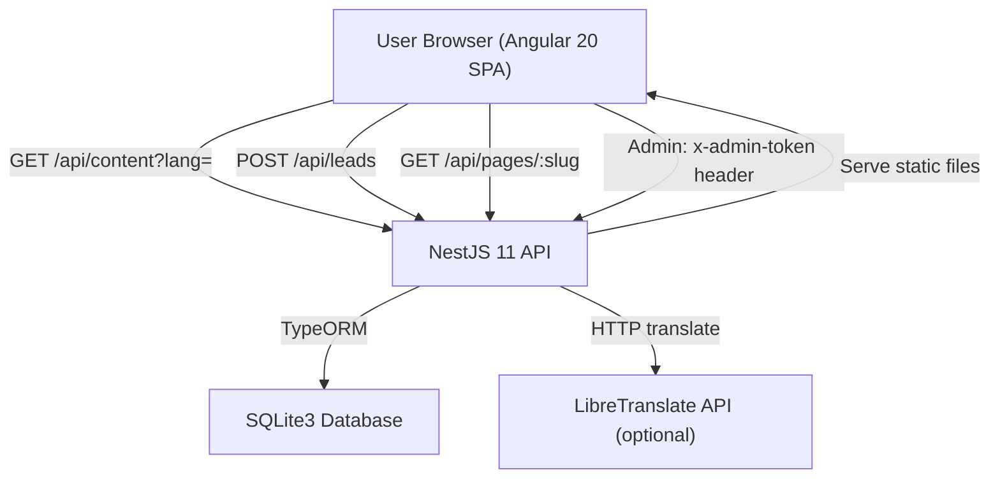

**Stack:**

| Layer    | Technology                          |
|----------|-------------------------------------|
| Frontend | Angular 20, Signals, Standalone     |
| Backend  | NestJS 11, TypeORM, class-validator |
| Database | SQLite3 (file-based)                |
| Build    | Multi-stage Docker (Node 24-alpine) |
| Icons    | FontAwesome Free 7.x               |
| Fonts    | Montserrat, Ubuntu (Google Fonts)   |

---

## 4. Use Cases

### UC-001 — View Landing Page

**Summary:** Visitor loads the landing page and sees localized marketing content.

**Description:** Browser fetches available locales, resolves user language from `?lang=` or defaults to EN, loads content payload, renders hero + pain points + features + comparison + metrics + how-it-works + contact form + footer.

**Related BR/WF:** BR-001, BR-003, BR-004, WF-001

**Flow (Mermaid):**

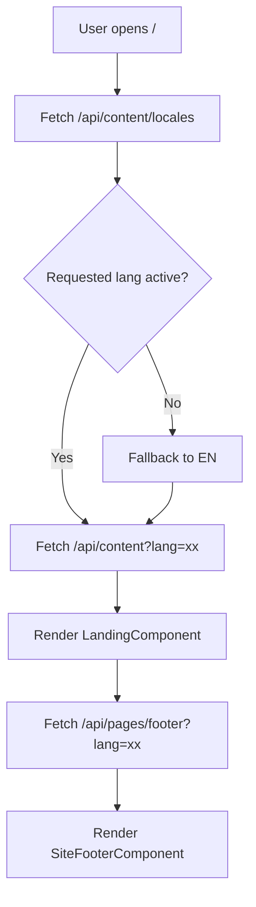

**Baseline screenshots:** `docs/ui-baselines/UC-001/`

**Failure modes:**

- API unreachable: "Failed to load content. Please retry."
- Locale inactive: "Selected language is inactive. Showing English."

---

### UC-002 — Submit Lead

**Summary:** Visitor fills the contact form and submits a lead.

**Description:** User fills name (opt), email (req), phone (opt), message (opt). Frontend validates email format. POST `/api/leads` with payload + current lang. Success resets form and shows thank-you. Failure shows generic error.

**Related BR/WF:** BR-002, WF-002

**Flow (Mermaid):**

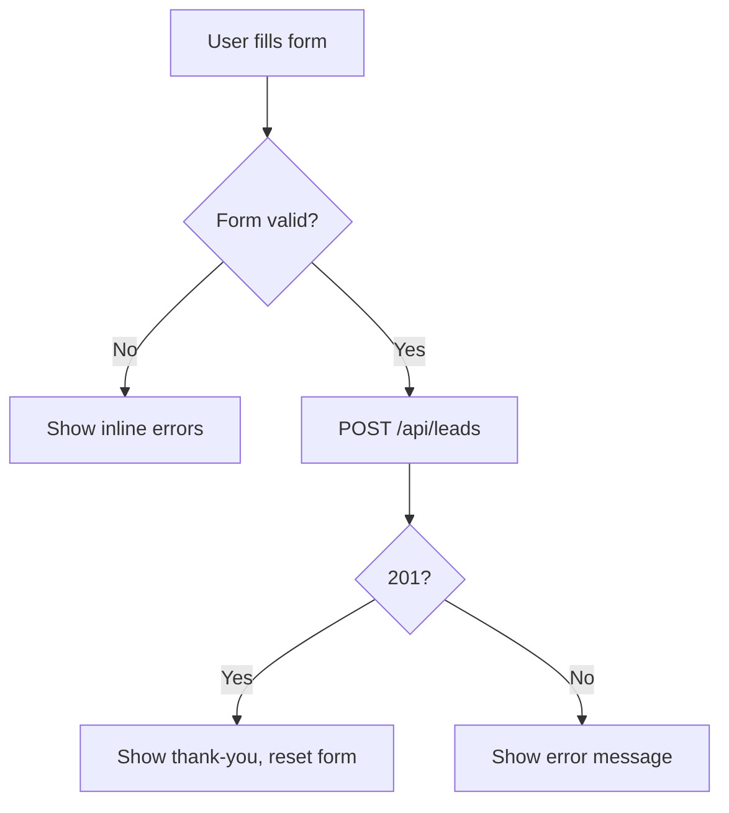

**Baseline screenshots:** `docs/ui-baselines/UC-002/`

**Failure modes:**

- Validation: inline "Email is required" / "Invalid email"
- Server error: "Unable to send request. Please try again."

---

### UC-003 — Switch Language

**Summary:** Visitor toggles locale selector to view content in another language.

**Description:** User selects locale from dropdown. Frontend updates `?lang=` query param, fetches new content. If locale inactive, falls back to EN with warning. Contact form resets. Footer reloads for new locale.

**Related BR/WF:** BR-003, BR-004, WF-001

**Flow (Mermaid):**

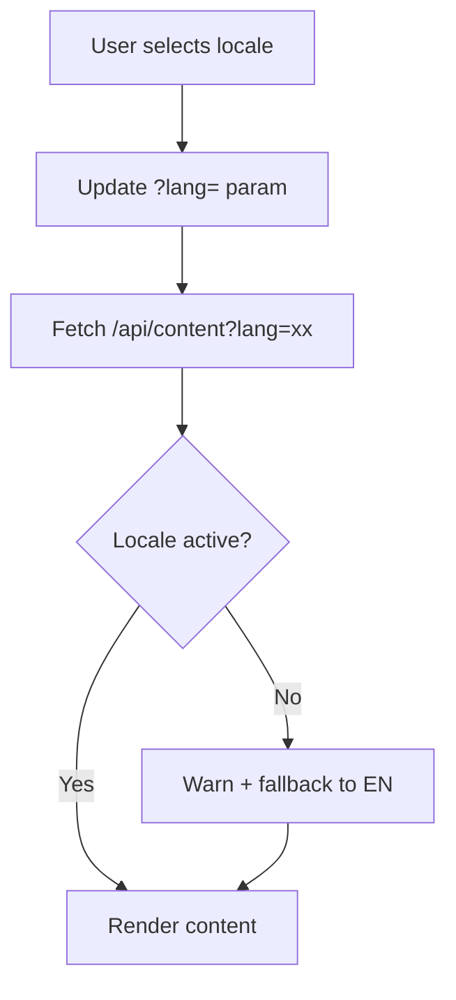

**Baseline screenshots:** `docs/ui-baselines/UC-003/`

**Failure modes:**

- Locale unavailable: "Language unavailable. Showing English."
- Locale inactive: "Selected language is inactive. Showing English."

---

### UC-004 — Admin Login

**Summary:** Admin enters token to access the admin panel.

**Description:** Admin navigates to `/admin`, enters token in form. Token saved to localStorage and sent as `x-admin-token` header on all admin API calls. Invalid token returns 401.

**Related BR/WF:** BR-005, BR-006

**Flow (Mermaid):**

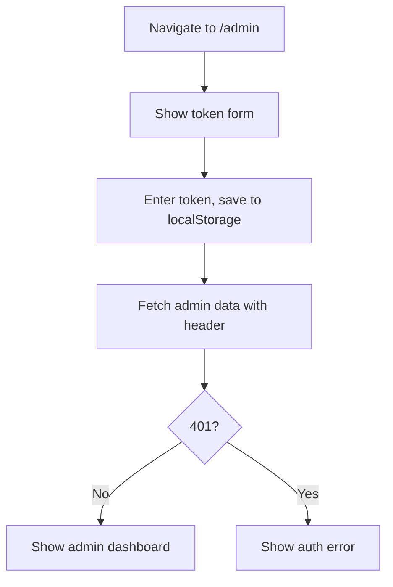

**Baseline screenshots:** `docs/ui-baselines/UC-004/`

**Failure modes:**

- Invalid token: 401 UnauthorizedException
- Missing header: 401 UnauthorizedException

---

### UC-005 — Manage Landing Content

**Summary:** Admin edits hero, features, comparison, and other landing sections.

**Description:** Admin selects locale in Setup > Main Page. Form loads current JSON payload. Admin edits text fields, reorders arrays via drag-and-drop, uses HTML editor for rich content. On save, PUT `/api/admin/content`.

**Related BR/WF:** BR-007, WF-003

**Flow (Mermaid):**

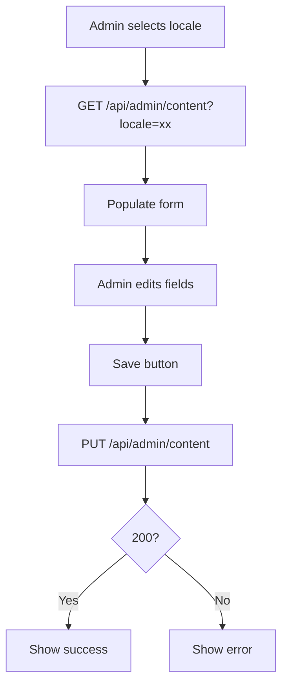

**Baseline screenshots:** `docs/ui-baselines/UC-005/`

**Failure modes:**

- Validation: 400 if locale invalid or content malformed
- Auth: 401 if token invalid

---

### UC-006 — Create New Locale via Auto-Translation

**Summary:** Admin creates a draft locale by auto-translating EN content.

**Description:** Admin enters new locale code (e.g. `pl`). POST `/api/content/locales` with source=EN. Backend calls LibreTranslate to translate all text strings. Returns translated payload with `active=false`. Admin reviews and toggles active.

**Related BR/WF:** BR-008, WF-004

**Flow (Mermaid):**

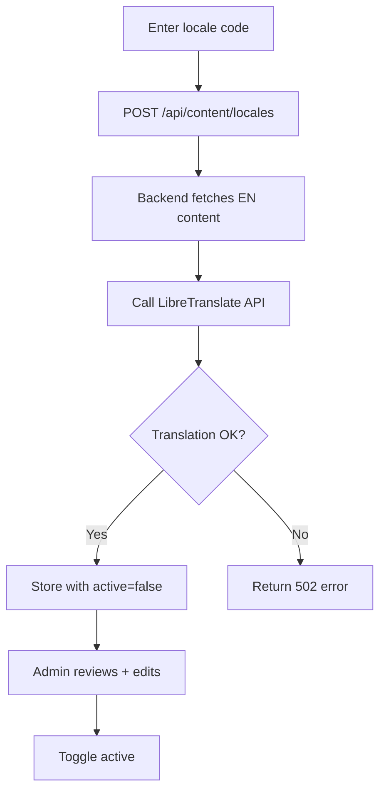

**Baseline screenshots:** `docs/ui-baselines/UC-006/`

**Failure modes:**

- Duplicate locale: 400 "Locale already exists"
- Translation failure: 502 "Failed to translate content"

---

### UC-007 — Toggle Locale Active Status

**Summary:** Admin activates or deactivates a non-EN locale.

**Description:** Admin toggles locale checkbox. PATCH updates `active` flag. EN cannot be deactivated. Inactive locales hidden from public picker.

**Related BR/WF:** BR-003, BR-004

**Flow (Mermaid):**

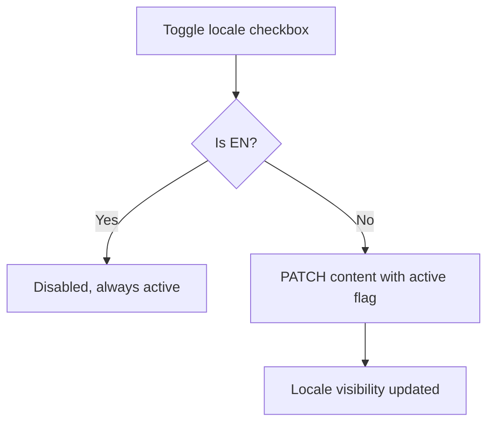

**Baseline screenshots:** `docs/ui-baselines/UC-007/`

**Failure modes:**

- EN toggle: disabled in UI
- Auth: 401 if token invalid

---

### UC-008 — View and Filter Leads

**Summary:** Admin views submitted leads with search and filter controls.

**Description:** Admin clicks Leads tab. Fetches `/api/admin/leads` with filters: exported status (all/exported/unexported), includeBad, search text. List shows ID, name, email, phone, date, flags. Sortable columns.

**Related BR/WF:** BR-009, WF-005

**Flow (Mermaid):**

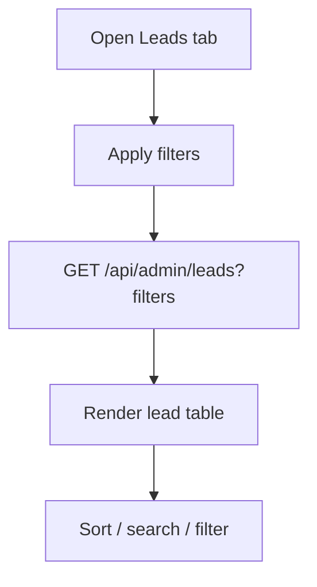

**Baseline screenshots:** `docs/ui-baselines/UC-008/`

**Failure modes:**

- Auth: 401 if token invalid
- Empty results: show "No leads found"

---

### UC-009 — Export Leads to CSV

**Summary:** Admin exports unexported good leads to CSV file.

**Description:** Admin clicks Export. GET `/api/admin/leads/export`. Backend returns CSV of unexported + not-bad leads, marks them with `exportedAt`. Browser downloads file.

**Related BR/WF:** BR-009, WF-005

**Flow (Mermaid):**

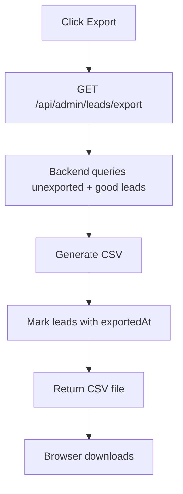

**Baseline screenshots:** `docs/ui-baselines/UC-009/`

**Failure modes:**

- No leads to export: empty CSV with headers only
- Auth: 401 if token invalid

---

### UC-010 — Mark Lead as Bad/Good

**Summary:** Admin flags a lead as spam/duplicate.

**Description:** Admin clicks bad/good toggle on lead row. PATCH `/api/admin/leads/:id/bad`. Bad leads excluded from export by default.

**Related BR/WF:** BR-009

**Flow (Mermaid):**

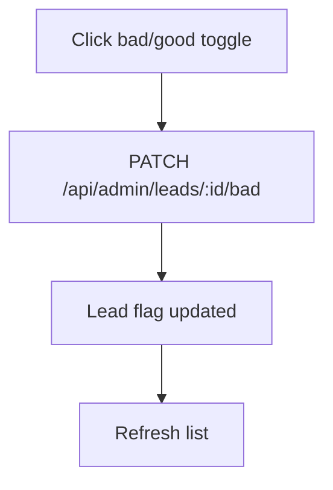

**Baseline screenshots:** `docs/ui-baselines/UC-010/`

**Failure modes:**

- Lead not found: 404
- Auth: 401 if token invalid

---

### UC-011 — Manage Page Categories

**Summary:** Admin creates and manages footer link categories.

**Description:** Admin in Setup > Content > Categories. Creates category with unique code, title, active flag. Can toggle active, edit translations. Active categories with published pages appear in footer.

**Related BR/WF:** BR-010, WF-006

**Flow (Mermaid):**

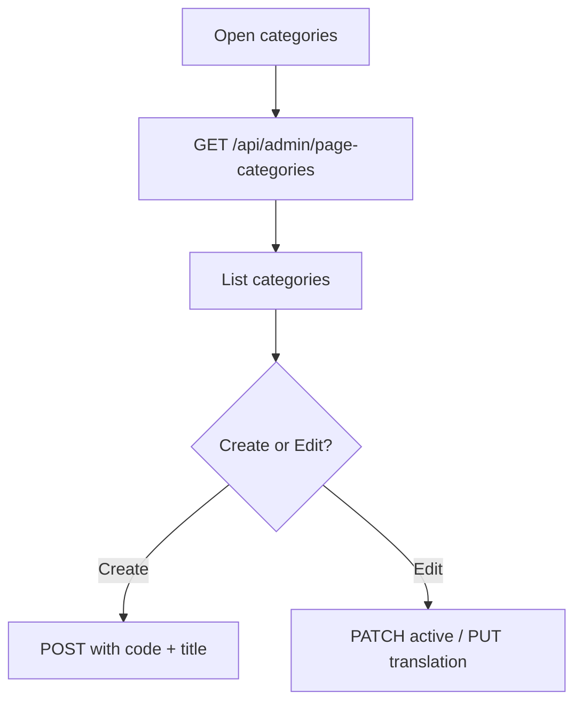

**Baseline screenshots:** `docs/ui-baselines/UC-011/`

**Failure modes:**

- Duplicate code: 400
- Auth: 401 if token invalid

---

### UC-012 — Create Static Page

**Summary:** Admin creates a new static page under a category.

**Description:** Admin fills slug, selects category, enters title and HTML content. POST `/api/admin/pages`. Page starts as unpublished. Admin can publish and add translations.

**Related BR/WF:** BR-011, WF-006

**Flow (Mermaid):**

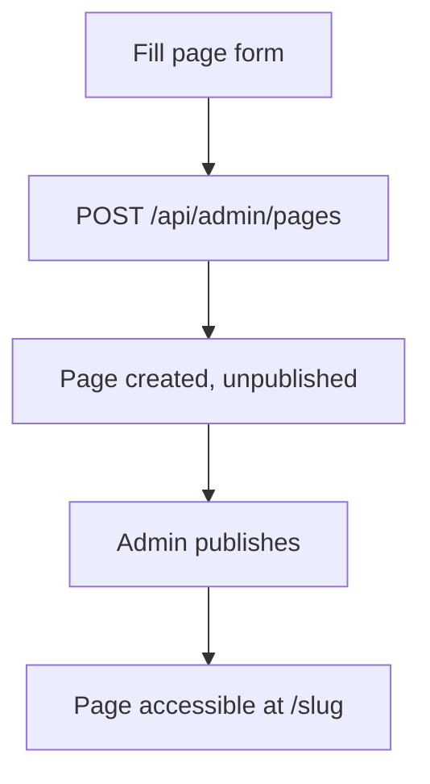

**Baseline screenshots:** `docs/ui-baselines/UC-012/`

**Failure modes:**

- Duplicate slug: 400
- Invalid category: 400
- Auth: 401 if token invalid

---

### UC-013 — View Public Static Page

**Summary:** Visitor navigates to a published static page.

**Description:** User goes to `/:slug`. Frontend fetches `/api/pages/:slug?lang=xx`. Backend checks page is published and category is active. Returns translation for locale (falls back to EN).

**Related BR/WF:** BR-011, BR-012, WF-007

**Flow (Mermaid):**

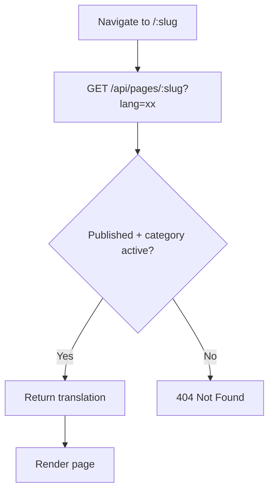

**Baseline screenshots:** `docs/ui-baselines/UC-013/`

**Failure modes:**

- Not published: 404 "Page not found"
- Category inactive: 404 "Page not found"
- No translation: fallback to EN

---

### UC-014 — Edit Page Translation

**Summary:** Admin adds or updates a page translation for a locale.

**Description:** Admin opens page editor, selects locale, edits title and HTML content. PUT `/api/admin/pages/:id/translations`. Upserts translation.

**Related BR/WF:** BR-011, WF-006

**Flow (Mermaid):**

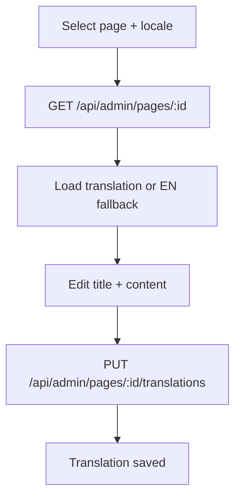

**Baseline screenshots:** `docs/ui-baselines/UC-014/`

**Failure modes:**

- Page not found: 404
- Auth: 401 if token invalid

---

### UC-015 — View Footer Links

**Summary:** Footer component loads and renders active categories with published pages.

**Description:** SiteFooterComponent receives current language. GET `/api/pages/footer?lang=xx`. Renders categories as column headings with page links underneath.

**Related BR/WF:** BR-010, BR-011, WF-007

**Flow (Mermaid):**

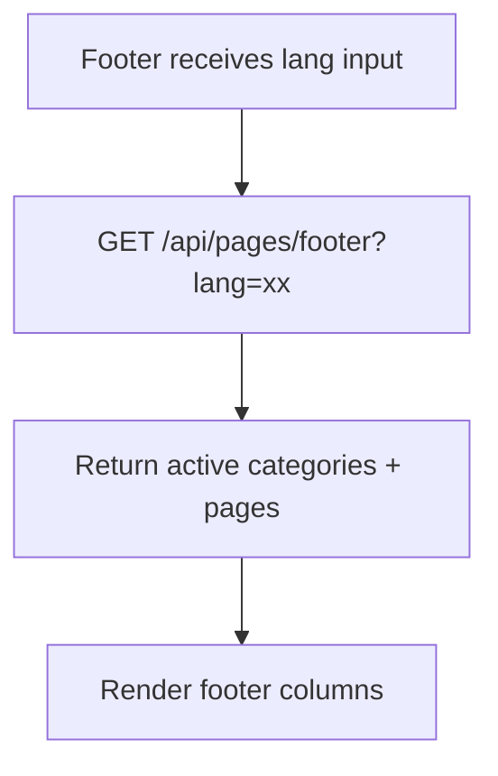

**Baseline screenshots:** `docs/ui-baselines/UC-015/`

**Failure modes:**

- API error: footer hidden, error logged
- No categories: footer not rendered

---

## 5. Business Rules

### BR-001 — English Always Available

EN locale always exists, is always active, and always has content. If any locale fetch fails, the system falls back to EN. Users cannot deactivate EN.

### BR-002 — Lead Validation

| Field   | Required | Max Length | Format       |
|---------|----------|------------|--------------|
| email   | Yes      | 160        | Valid email   |
| name    | No       | 120        | Free text     |
| phone   | No       | 60         | Free text     |
| message | No       | 1000       | Free text     |

All strings trimmed before storage.

### BR-003 — Locale Normalization

| Input        | Normalized |
|--------------|------------|
| uk, uk-UA, UA| ua         |
| en, en-US, EN| en         |
| Other        | lowercase  |
| Empty/null   | en         |

### BR-004 — Locale Active Status

- `active=true`: appears in public locale picker
- `active=false`: hidden from picker, forces fallback to EN
- EN is always `active=true`, toggle disabled

### BR-005 — Admin Token Authentication

All `/api/admin/*` routes require `x-admin-token` header matching `ADMIN_TOKEN` env var. Missing or invalid token returns 401.

### BR-006 — Admin Token Persistence

Token stored in browser localStorage. Persists across page reloads. Cleared on explicit logout.

### BR-007 — Content Storage as JSON

Landing content stored as a single JSON string in `landing_content.payload`. Entire payload serialized/deserialized atomically.

### BR-008 — Auto-Translation

New locales created by translating all text strings from source locale via LibreTranslate API. Created with `active=false` for admin review. Translation failure returns 502.

### BR-009 — Lead Export Atomicity

Export query: `bad=false AND exportedAt IS NULL`. All exported leads atomically stamped with same `exportedAt` timestamp. Subsequent exports only return new leads.

### BR-010 — Page Category Constraints

Categories require unique kebab-case `code` (immutable after creation). Must have at least one translation (EN at creation). Only active categories appear in footer.

### BR-011 — Static Page Constraints

Pages require unique kebab-case `slug` (immutable after creation). Must have a category. Published pages in active categories are publicly accessible. Unpublished or inactive-category pages return 404.

### BR-012 — Page Locale Fallback

If page translation for requested locale is missing, fallback to EN. If EN translation also missing, use slug as title with empty content.

---

## 6. Workflows

### WF-001 — Landing Page Load

1. Browser loads `/`
2. Fetch `/api/content/locales`
3. Resolve user locale from `?lang=` or Accept-Language
4. Fetch `/api/content?lang=<resolved>`
5. Render LandingComponent
6. Fetch `/api/pages/footer?lang=<resolved>`
7. Render SiteFooterComponent

### WF-002 — Lead Submission

1. User fills contact form
2. Frontend validates on blur (email format, required)
3. On submit: POST `/api/leads` with payload + lang
4. Backend validates, stores in SQLite
5. 201 → show thank-you, reset form
6. Error → show "try again" message

### WF-003 — Content Editing

1. Admin logs in with token
2. Setup > Main Page, select locale
3. GET `/api/admin/content?locale=xx`
4. Edit fields, drag-reorder arrays, HTML editor
5. PUT `/api/admin/content` with updated JSON
6. Success → refresh locale index

### WF-004 — New Locale Creation

1. Admin enters new locale code
2. POST `/api/content/locales` with source locale
3. Backend fetches source content, extracts text strings
4. Calls LibreTranslate API
5. Assembles translated payload, stores with `active=false`
6. Admin reviews, edits, toggles active

### WF-005 — Lead Export

1. Admin opens Leads tab, applies filters
2. Clicks Export
3. GET `/api/admin/leads/export`
4. Backend returns CSV of unexported + good leads
5. Marks exported leads with `exportedAt`
6. Browser downloads CSV

### WF-006 — Page Management

1. Admin manages categories (create/toggle/translate)
2. Creates pages with slug, category, translations
3. Publishes pages
4. Published pages in active categories appear in footer and at `/:slug`

### WF-007 — Public Page Access

1. User navigates to `/:slug`
2. Frontend fetches `/api/pages/:slug?lang=xx`
3. Backend checks: published=true, category.active=true
4. Returns translation (EN fallback)
5. Frontend renders title + HTML content

---

## 7. Data Entities

### LandingContent

| Column     | Type      | Constraints        |
|------------|-----------|--------------------|
| id         | INTEGER   | PK, autoincrement  |
| locale     | TEXT      | UNIQUE, NOT NULL   |
| payload    | TEXT      | NOT NULL (JSON)    |
| created_at | TIMESTAMP | DEFAULT NOW        |
| updated_at | TIMESTAMP | DEFAULT NOW        |

### Lead

| Column      | Type      | Constraints        |
|-------------|-----------|--------------------|
| id          | INTEGER   | PK, autoincrement  |
| name        | TEXT      | Nullable, max 120  |
| email       | TEXT      | NOT NULL, max 160  |
| phone       | TEXT      | Nullable, max 60   |
| message     | TEXT      | Nullable, max 1000 |
| lang        | TEXT      | Nullable, max 5    |
| bad         | BOOLEAN   | DEFAULT false      |
| exported_at | TIMESTAMP | Nullable           |
| created_at  | TIMESTAMP | DEFAULT NOW        |

### PageCategory

| Column     | Type      | Constraints        |
|------------|-----------|--------------------|
| id         | INTEGER   | PK, autoincrement  |
| code       | TEXT      | UNIQUE, NOT NULL   |
| active     | BOOLEAN   | DEFAULT true       |
| created_at | TIMESTAMP | DEFAULT NOW        |
| updated_at | TIMESTAMP | DEFAULT NOW        |

### PageCategoryTranslation

| Column      | Type    | Constraints                      |
|-------------|---------|----------------------------------|
| id          | INTEGER | PK, autoincrement                |
| category_id | INTEGER | FK → page_categories, CASCADE    |
| locale      | TEXT    | NOT NULL                         |
| title       | TEXT    | NOT NULL                         |
| created_at  | TIMESTAMP | DEFAULT NOW                    |
| updated_at  | TIMESTAMP | DEFAULT NOW                    |

UNIQUE(category_id, locale)

### StaticPage

| Column      | Type    | Constraints                      |
|-------------|---------|----------------------------------|
| id          | INTEGER | PK, autoincrement                |
| slug        | TEXT    | UNIQUE, NOT NULL                 |
| published   | BOOLEAN | DEFAULT false                    |
| category_id | INTEGER | FK → page_categories, RESTRICT   |
| created_at  | TIMESTAMP | DEFAULT NOW                    |
| updated_at  | TIMESTAMP | DEFAULT NOW                    |

### StaticPageTranslation

| Column     | Type    | Constraints                    |
|------------|---------|--------------------------------|
| id         | INTEGER | PK, autoincrement              |
| page_id    | INTEGER | FK → static_pages, CASCADE     |
| locale     | TEXT    | NOT NULL                       |
| title      | TEXT    | NOT NULL                       |
| content    | TEXT    | NOT NULL (HTML)                |
| created_at | TIMESTAMP | DEFAULT NOW                  |
| updated_at | TIMESTAMP | DEFAULT NOW                  |

UNIQUE(page_id, locale)

---

## 8. API Route Inventory

### Public Routes

| Method | Path                      | Purpose                      | Status Codes     |
|--------|---------------------------|------------------------------|------------------|
| GET    | /api                      | Health check                 | 200              |
| GET    | /api/health               | Health probe                 | 200              |
| GET    | /api/content/locales      | List available locales       | 200              |
| GET    | /api/content?lang=        | Get landing content          | 200              |
| POST   | /api/leads                | Submit lead                  | 201, 400         |
| GET    | /api/pages/footer?lang=   | Get footer links             | 200              |
| GET    | /api/pages/:slug?lang=    | Get public page              | 200, 404         |

### Admin Routes (x-admin-token required)

| Method | Path                                      | Purpose                  | Status Codes       |
|--------|-------------------------------------------|--------------------------|--------------------|
| GET    | /api/admin/content?locale=                | Get content for editing  | 200, 401           |
| PUT    | /api/admin/content                        | Update content           | 200, 400, 401      |
| POST   | /api/content/locales                      | Create locale            | 201, 400, 401, 502 |
| GET    | /api/admin/leads                          | List leads               | 200, 401           |
| GET    | /api/admin/leads/export                   | Export CSV               | 200, 401           |
| PATCH  | /api/admin/leads/:id/bad                  | Toggle bad flag          | 200, 401, 404      |
| GET    | /api/admin/page-categories                | List categories          | 200, 401           |
| POST   | /api/admin/page-categories                | Create category          | 201, 400, 401      |
| PATCH  | /api/admin/page-categories/:id            | Update category          | 200, 401, 404      |
| PUT    | /api/admin/page-categories/:id/translations | Upsert translation    | 200, 400, 401      |
| GET    | /api/admin/pages                          | List pages               | 200, 401           |
| GET    | /api/admin/pages/:id                      | Get page                 | 200, 401, 404      |
| POST   | /api/admin/pages                          | Create page              | 201, 400, 401      |
| PATCH  | /api/admin/pages/:id                      | Update page              | 200, 400, 401, 404 |
| PUT    | /api/admin/pages/:id/translations         | Upsert translation       | 200, 400, 401, 404 |
